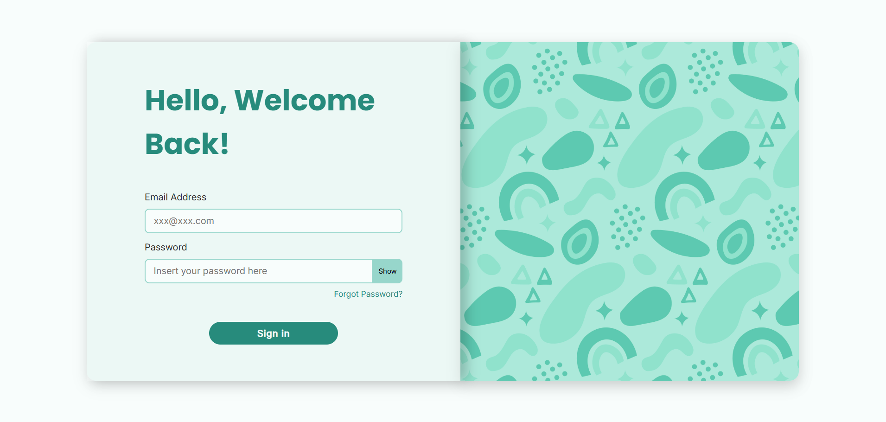

# Login Page

Este projeto é uma interface de login, criada com HTML, CSS e JavaScript puro. Ele inclui uma tela de login simples e uma página visual de "Esqueci minha senha", com campos de entrada e feedback simulado para o usuário.

---

## Preview 

## Objetivo

O objetivo do projeto é simular uma interface moderna e acessível de autenticação de usuário, incluindo:

- Tela de login com campos para e-mail e senha.
- Botão para exibir ou ocultar a senha digitada.
- Link para página de **"Forgot Password"**, onde o usuário pode "solicitar" a recuperação da conta.
- Feedback visual estilizado sem uso de bibliotecas externas.

## 🛠️ Tecnologias Utilizadas

- **HTML5**
- **CSS3** (com uso de variáveis CSS e Flexbox)
- **JavaScript Vanilla** (puro, sem frameworks)
- **Google Fonts** (Inter e Poppins)

---
